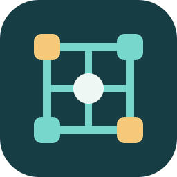

  

<h1 align="center">Agent Worksystem Builder</h1>

在 Codex 中，从想法构筑完整智能系统。

  简体中文 · <a href="README.md">English</a> · <a href="#开始使用">开始使用</a> · <a href="docs/quickstart.md">使用指南</a>

**描述你需要的系统，与 Codex 一起探索、构筑并验证。**

Agent Worksystem Builder（AWB，智能系统构筑器）是一个 Codex 插件，通过持续对话，设计、编排、实现并改进完整智能系统。它将需求、软件架构与可选智能层编排贯通起来：既关注普通程序、界面、服务与数据，也关注模型、Agent、Skill、插件及 MCP 如何参与。

当前为实验性预览版 **0.2.0-alpha.1**，能力与验证进展见[交付状态](docs/delivery-status.md)。

## 为什么用 AWB？

- **始终围绕完整目标。** 随着新证据出现，持续讨论需求与关键决策，交付前检查整体目标是否得到覆盖。
- **用探索支持决策。** 发现现有资源，检索资料、比较方案、试验原型，根据任务、不确定性与预算调整探索方式。
- **让架构适应需求。** 分别组织普通软件与智能层，目标系统拥有独立运行方式和业务数据；确定性代码足够时，无需引入 AI。

## 开始使用

在 Codex 中安装：

~~~powershell
codex plugin marketplace add iyohesohoka646-dotcom/agent-worksystem-builder --ref main
codex plugin add agent-worksystem-builder@agent-worksystem-builder-plugins
~~~

开启新的 Codex 会话，选择 `agent-worksystem-builder:building-agent-worksystems`，直接描述你的目标。构筑从当前会话开始，无需打开 AWB 网站或启动 Builder 服务。

> 我的目标是：&lt;描述你的工作方式、已有项目或系统构想&gt;。
>
> 使用 AWB 发现现有资源，持续讨论关键需求，探索架构选择，再实现并核验完整系统。保留已有接口和无关改动，重大取舍与我讨论。

也可以[下载插件 ZIP](https://github.com/iyohesohoka646-dotcom/agent-worksystem-builder/raw/refs/heads/main/packages/0.2.0-alpha.1/agent-worksystem-builder-0.2.0-alpha.1-plugin.zip)，按[安装指南](docs/quickstart.md)操作。共享 Python 工具需要 Python 3.11+，依赖配置见指南。

## 它如何工作？

**讨论目标 → 探索方案 → 设计 → 实现 → 验证 → 决定下一步。**

需求 grill 贯穿建设过程：复用已有答案，先探查可发现事实，再把关键取舍交给用户。“评估—创造—验证—决策”循环随证据、目标和预算变化重新审视方案。

一个总控组合五个专职 Skill：**澄清、探索、设计、执行、验证**。它们共同处理目标系统的整体软件架构，以及可选智能层中的交互式／非交互式参与、模型、资源和权限配置。模块分工见[架构说明](docs/plugin-architecture.md)。

## 从你的实际需求出发

这些都可以成为起点，具体架构由需求决定：

- **构筑新系统：** 组织多个项目、任务类型、数据流、服务与智能参与点。
- **改造已有应用：** 保留原有接口与测试，在探索证明有价值的位置加入智能能力。
- **制作专用工具：** 交付独立程序，省去多余的模型调用、Agent 和常驻服务。

设计空间保持开放，组合方式见[系统级构筑说明](docs/system-level-construction.md)。

## 深入了解

- **使用：** [安装与首次对话](docs/quickstart.md) · [升级与回退](docs/upgrade-0.2.md)
- **原理：** [插件架构](docs/plugin-architecture.md) · [运行接口](docs/interfaces.md)
- **证据：** [交付状态与已知限制](docs/delivery-status.md) · [评测协议](https://github.com/iyohesohoka646-dotcom/agent-worksystem-builder/blob/main/evals/README.md) · [工程检查](https://github.com/iyohesohoka646-dotcom/agent-worksystem-builder/actions/workflows/ci.yml)
- **参与：** [反馈问题或提出想法](https://github.com/iyohesohoka646-dotcom/agent-worksystem-builder/issues) · [双语项目介绍](docs/share.md)
